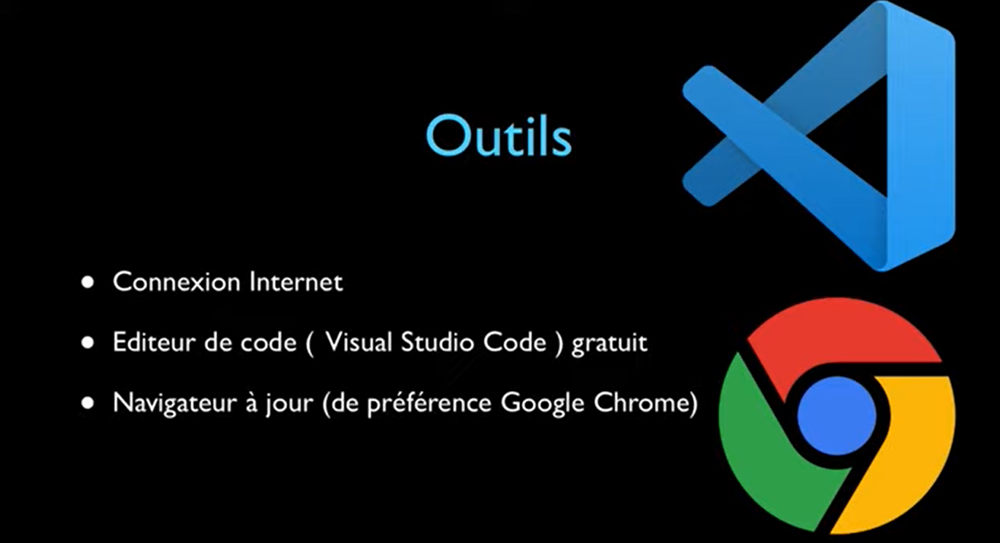
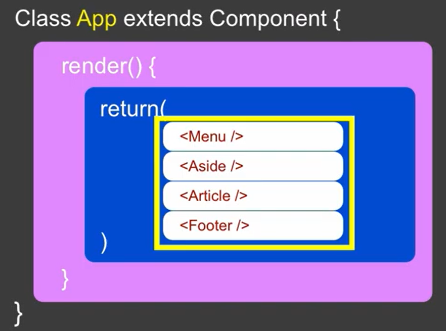

# base-react-js
React est l'un des frameworks front-end le plus populaire pour les applications Web. Dans cet article, nous allons apprendre ce qu'est React (anciennement ReactJS) et pourquoi nous devrions utiliser React au lieu d'autres frameworks JavaScript comme Angular
## C'est quoi React ?

## Qui utilise React ?

## Prérequis

## Outils

## Les composants en React
Les composants vous permettent de découper l’interface utilisateur en éléments indépendants et réutilisables, vous permettant ainsi de considérer chaque élément de manière isolée. Cette page fournit une introduction au concept de composants. Vous trouverez une référence détaillée de [l’API des composants ici](https://fr.reactjs.org/docs/react-component.html).
## Syntaxe des composant en React
