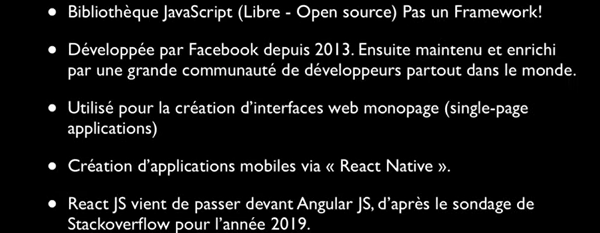
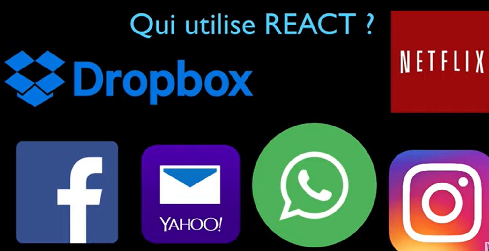
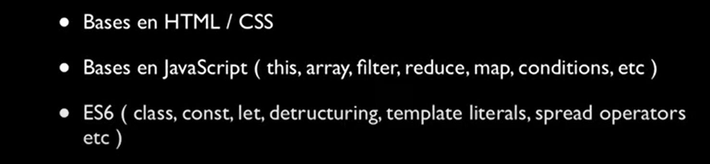

# base-react-js
React est l'un des frameworks front-end le plus populaire pour les applications Web. Dans cet article, nous allons apprendre ce qu'est React (anciennement ReactJS) et pourquoi nous devrions utiliser React au lieu d'autres frameworks JavaScript comme Angular
## C'est quoi React ?

## Qui utilise React ?

## Prérequis

